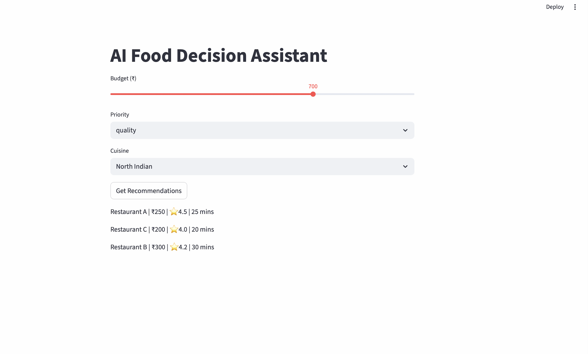

# 🍽️ AI Food Decision Assistant (Swiggy MCP Ready)

An AI-powered decision engine that converts natural language cravings into structured preferences and provides **explainable restaurant recommendations**.

---

## 🚀 Demo



---

## 👤 Who I Am

Individual developer building an AI-driven decision assistant for food discovery and ordering optimization.

---

## 💡 What This App Does

This app helps users answer:

👉 *"What should I eat?"*

Instead of filters, it uses:

- Natural language understanding  
- Weighted decision logic  
- Explainable recommendations  

---

## 🧠 Problem Solved

Food apps today:
- Show too many options  
- Lack reasoning  
- Require manual filtering  

This app:
- Understands intent directly  
- Reduces decision fatigue  
- Explains *why* a restaurant is recommended  

---

## ⚙️ How It Works

```
User Input (Natural Language)
        ↓
LLM Interpretation (intent → weights)
        ↓
Weighted Scoring Engine
        ↓
Filtered Restaurants
        ↓
Explainable Recommendations
```

---

## 🧠 AI Interpretation

Examples:

- "cheap food" → cost ↑  
- "best quality" → quality ↑  
- "fast delivery" → delivery ↑  

Budget slider dynamically influences cost sensitivity.

---

## 📊 Decision Variables

| Variable | Meaning |
|--------|--------|
| Cost | Budget sensitivity |
| Quality | Ratings & experience |
| Delivery | Speed |

---

## 🍽️ Supported Cuisines

- North Indian  
- Chinese  
- Italian  
- Biryani  
- South Indian  
- Fast Food  

---

## 🧮 Recommendation Logic

- Multi-objective weighted scoring  
- Budget-aware filtering  
- Preference-based ranking  

---

## 💬 Explainability Layer

Each recommendation includes:

- Why it matches user intent  
- Price-quality balance  
- Delivery alignment  
- Cuisine match  

---

## 🔁 Personalization (Learning)

- Stores user preferences (session-based)
- Adapts weights over time
- Ready for feedback loop (like/dislike)

---

## 🔗 MCP Integration (Swiggy Ready)

This app acts as a **decision intelligence layer before MCP execution**

### MCP Flow:

```
User Intent → AI Assistant → (THIS APP) → Swiggy MCP → Order Execution
```

### Value Addition:

- Better intent understanding  
- Transparent recommendations  
- Reduced friction  

---

## 🧰 Tech Stack

- Frontend: Streamlit  
- Backend: Python  
- LLM: Groq (Llama / GPT OSS)  
- Data: Mock dataset (API-ready)

---

## 🔐 Compliance with Swiggy Guidelines

### ✅ Allowed

- AI-based recommendation engine  
- Transparent reasoning  
- MCP-compatible architecture  

### 🚫 Not Doing

- No scraping  
- No misleading pricing  
- No API misuse  
- No ranking manipulation  

---

## 📦 Future Enhancements

- Swiggy API integration  
- Real-time pricing  
- Menu-level recommendations  
- MCP direct ordering  

---

## ▶️ Run Locally

```bash
pip install -r requirements.txt
streamlit run app.py
```

---

## 🌐 Deployment

Deploy on Streamlit Cloud for public URL.

---

## 📊 Expected Scale

- Current: <1K requests/day  
- Scalable to MCP integration  

---

## 🔐 Data & Security

- No personal data stored  
- No payment handling  
- Safe architecture  

---

## 📎 GitHub / Demo

https://github.com/amit2947/ai-decision-engine-swiggy-mcp

---

## 🧠 Why This Matters

Food ordering is shifting:

👉 UI-based → Intent-based decision systems  

This app builds the **decision layer for AI commerce**.

---